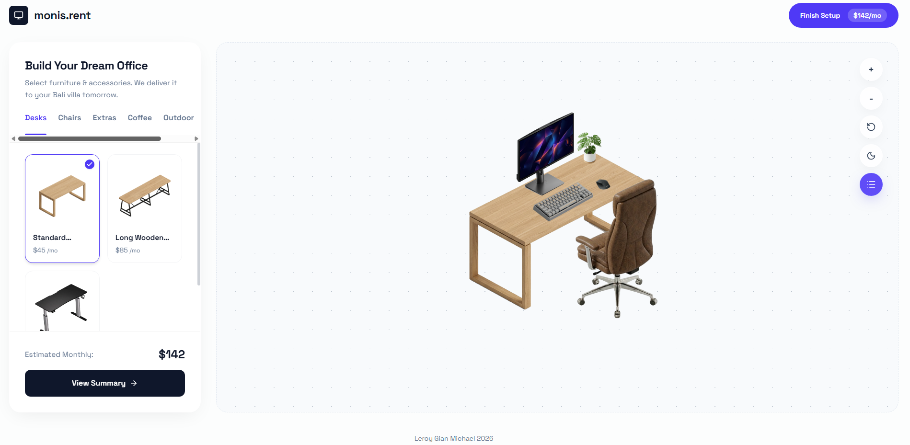

# Moris Rent


This project was genuinely fun to build. I got to express my own ideas and actually solve a real problem of making a workspace rental feel exciting instead of transactional.

## The Idea

The core approach is **gamification**. People who grew up playing The Sims already understand the mental model: you pick furniture, place it in a room, and watch your space come to life. By borrowing that same layout, system, and visual language, users learn how to configure their workspace almost instantly even though it's a completely new way to rent something.

## How It Works

The grid-based configurator is the heart of the UI. Everything is built around an isometric perspective where each zone (the desk surface, side table, front yard, and relax area) has its own grid. This keeps placement predictable and collision-free while still giving users the genuine feeling that they're building something that's theirs.

State is managed entirely with React `useState`. No external library was needed since all interactions (selecting, adding, moving, and removing items) stay local to a single `WorkspaceBuilder` component and flow down as props. The inventory lives in a flat `data.ts` file, so adding new furniture never requires touching any component logic.

## How I Used AI in This Project

AI made this project significantly faster and better in a few ways.

First, every single asset was generated as an isometric image facing the same angle. This consistency is what makes the canvas feel cohesive rather than like a collage of random images, and it also makes every item look more high quality against the isometric grid.

Second, the workflow mattered a lot. Using a context bank and breaking tasks down into small focused chunks meant the AI could execute with much lower hallucination. Instead of asking for everything at once, each session had one clear problem to solve, which produced much cleaner code.

## Tech Choices

| Tool                    | Why                                                                                                   |
| ----------------------- | ----------------------------------------------------------------------------------------------------- |
| Next.js 15 (App Router) | Fast to iterate with, handles SSR and client components cleanly                                       |
| TypeScript              | Strict types on `InventoryItem` and `PlacedItem` prevent mismatches between grid config and rendering |
| Tailwind CSS            | Utility-first styling made the panel, modal, and canvas UI fast to build without context switching    |
| Lucide React            | Lightweight, consistent icons that fit the minimal aesthetic                                          |

## What I'd Improve with More Time

**Drag to place on canvas.** Right now items auto-place on the grid. Letting users drag items directly onto the isometric surface would make the experience feel even more like a game.

**More item variety.** The data model already supports unlimited items. The bottleneck is just producing more isometric assets.

**Save and share.** Serializing the workspace state to a URL or localStorage would let users bookmark their setup or send it to a friend.

**Realistic pricing flow.** The checkout works visually but it's a mock confirmation. Connecting it to a real backend or even a form would make it production-ready.

**Better mobile canvas interaction.** Pinch to zoom and touch-based item selection work but need more polish on smaller screens.

## Running Locally

```bash
pnpm install
pnpm dev
```

Open [http://localhost:3000](http://localhost:3000) to start building your workspace.

## Author

Leroy Gian Michael 2026
